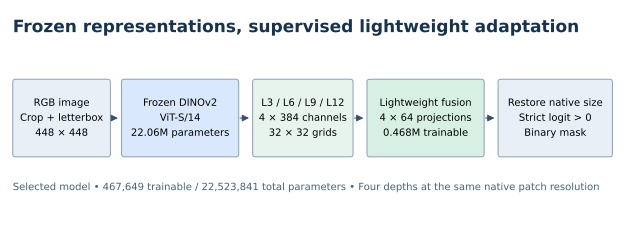
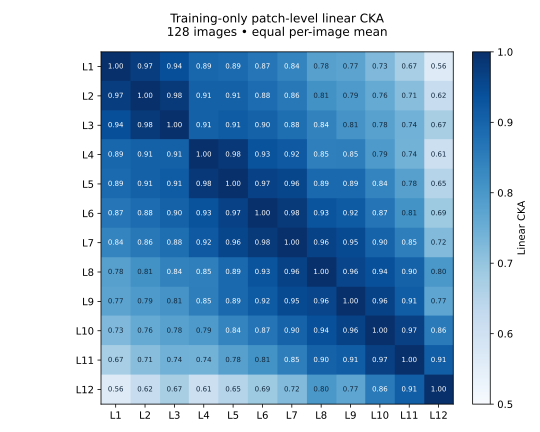

# Parameter-Efficient DINOv2 Adaptation for Colonoscopic Polyp Segmentation

A controlled study of frozen foundation representations under limited medical supervision: **467,649 trainable head parameters (2.08% of the full model)**, multi-depth feature ablations, normal-frame false-positive analysis, and a locked external evaluation.

**Selected model:** frozen DINOv2 ViT-S/14 + four-depth fusion decoder. **Status:** Phases 1–6 completed; Phase 7 hierarchical decoder interrupted and incomplete. These are single-seed development experiments, not a claim of state-of-the-art performance or a clinically validated system.



## Motivation and method

Can useful segmentation be learned from limited colonoscopy labels while keeping a pretrained visual encoder frozen? This project studies which transformer depths help, whether spatial refinement or partial fine-tuning justify their costs, and how segmentation quality trades off against false positives on normal frames.

The encoder is `timm`'s `vit_small_patch14_dinov2.lvd142m`. Normalized patch features from **L3/L6/L9/L12** are projected from 384 to 64 channels each, concatenated, and decoded with small convolutional blocks. All four native feature grids are 32×32 at 448×448 input; “multi-depth” does not imply a native multi-resolution backbone. RGB-only cropping, aspect-preserving letterboxing, and native-resolution logit restoration are shared across evaluation datasets. The final rule is strictly `restored_logit > 0`.

## Data and evaluation protocol

[PolypGen](https://www.nature.com/articles/s41597-023-01981-y) provides the development data from centers C1–C4. The manifest contains **1,066 training rows**; the selected `old_C1` sampler excludes 96 added normal-video frames, leaving **970 eligible frames**. Each update uses two frames per center plus one original C1 normal frame. Internal development validation has **257 frames: 219 positive and 38 normal**. These frame counts must not be interpreted as independent patients.

Training uses a fixed seed, 20 epochs × 152 updates, AdamW, and valid-region BCE + soft Dice. The fixed epoch-20 model is reported. Positive-image mean Dice and normal-frame false positives are reported separately; empty ground-truth masks do not inflate mean Dice. See [protocol](docs/experimental_protocol.md) and [data preparation](docs/data.md). **No datasets, pretrained weights, or trained checkpoints are distributed.**

## Experimental pipeline and verified results

| Phase | Question / result | Decision |
|---|---|---|
| 1: representation | L12 **78.1703%** → L3/L6/L9/L12 **82.4341%** Dice; +4.2638 pp, severe failures 22 → 15 | Retain multi-depth fusion |
| 2: layer probing | Best single layer L9 **80.1793%**; fusion +2.2548 pp | Depth selection matters |
| 2.5: linear CKA | Training-only patch CKA: L6–L9 **0.9173**, L9–L12 **0.7678** | Descriptive similarity, not proof of causal complementarity |
| 3: combinations | L9+L12 **81.7294%**; none of three tested two-layer combinations exceeded four-depth **82.4341%** | Retain four depths; reference runs span environments |
| 4: DetailSkip | Same-environment baseline **82.7368%** vs **82.8096%**; small-polyp Dice 80.0398% → 78.6949%; any-FP 11/38 → 18/38 | Reject DetailSkip (+51.5% head parameters) |
| 5: last-block fine-tuning | Dice **84.4470%**, small-polyp +1.4985 pp; any-FP 13/38 vs 11/38, mean false foreground area 0.6243% vs 0.1606% | Keep frozen model for the selected trade-off |
| 5.5: threshold sweep | Tested probability thresholds 0.10–0.90 did not meet both frozen FP budgets for FT | Keep the locked 0.5 threshold |
| 6: external evaluation | Locked frozen model, no adaptation on the evaluated sets | Report dataset-specific limits below |
| 7: hierarchical decoder | 478,465 trainable parameters; recovered at update 646/3,040 | Incomplete; no performance conclusion |

**82.4341% and 82.7368% are different frozen runs.** The former is the Phase 1/2 reference; the latter is the Phase 4 environment-matched baseline selected for Phase 6. Their difference is not an architectural improvement. FT is a separate candidate, not the final external model.



## External generalization: locked frozen model

| Dataset release | Frames | Positive mean Dice | Mean IoU | Interpretation |
|---|---:|---:|---:|---|
| CVC-ColonDB | 380 | **70.63%** | 61.94% | No earlier project use found in the local audit; independence from foundation pretraining is unknown |
| ETIS-LaribPolypDB | 196 | **70.71%** | 62.14% | Previously observed during early project development; **not a blind test** |
| CVC-300 | 60 | 89.25% | 81.84% | **All 60 images overlap this ColonDB release; not independent external evidence** |

Do not average these releases into an “independent external benchmark” score. They contain positive images and do not establish normal-frame rejection under external distribution shift. [Overlap evidence and details](docs/external_evaluation.md).

## Reproduction

Use Python 3.12 and install an appropriate PyTorch build for your platform, then the recorded dependencies:

```bash
python -m pip install -r requirements.txt
python scripts/smoke_test.py
```

Download data and DINOv2 weights separately as described in [data.md](docs/data.md). Commands run from the repository root; all data/weight/output locations are explicit. The first example requires an independently provisioned CUDA machine. Nothing provisions cloud compute or starts training on import.

```bash
# Frozen baseline: recorded loop, fixed sampler, one fresh run
python scripts/train.py --data-root datasets/polypgen --weights weights/dinov2_vits14_pretrain.pth --output runs/frozen --max-seconds 3600

# Internal validation, CPU by default
python scripts/eval.py --checkpoint runs/frozen/epoch-20.pt --data-root datasets/polypgen --output runs/internal-eval

# Training-only feature extraction + CKA; --sanity checks one image
python scripts/cka_analysis.py --data-root datasets/polypgen --weights weights/dinov2_vits14_pretrain.pth --output runs/cka --sanity

# External inference: data-root contains data/CVC-ColonDB/images and masks
python scripts/eval.py --checkpoint weights/frozen-baseline-epoch20.pt --require-final-lock --data-root datasets/external --manifest configs/external/CVC-ColonDB.jsonl --output runs/colondb
```

The last command requires the original selected checkpoint, which is deliberately not included. A newly trained checkpoint can be evaluated without `--require-final-lock`, but its output is a new run and must not be labeled as the published checkpoint's result. Remove `--sanity` for all 128 CKA images (approximately 1.2 GB feature cache).

**Reproduction scope:** original model, geometry, loss and sampler logic are retained; portable wrappers replace private cloud orchestration. Publication-time checks are CPU tests, not a fresh 20-epoch replication. Historical checkpoints/evidence stay local. Exact scores are not guaranteed across hardware and dependency versions. See [code provenance and portability](docs/reproducibility.md).

## Repository guide

- `runtime/`: original computational logic with documented portability edits; model variants for the ablations.
- `scripts/`: training context, evaluation, CKA and offline smoke test.
- `configs/`: locked hyperparameters, CKA subset and external manifests.
- `results/`: compact verified summaries, CSVs and overlap evidence for each phase.
- `docs/`: protocol, limitations, provenance and reproduction boundaries.
- `assets/`: aggregate diagrams only; no colonoscopy images.

## Limitations and project status

Internal validation informed multiple decisions; no patient-level independence, repeated-seed uncertainty estimate, or clinical utility has been established. Earlier C5 and ETIS contact is disclosed, not treated as unseen evaluation. Pretraining overlap cannot be excluded. Phase 7 is retained as unfinished work, not an improvement. The project contribution is controlled adaptation, evaluation and failure analysis, not authorship of DINOv2 or a proven new decoder family. [Full limitations](docs/limitations.md).

## Related work and attribution

- Oquab et al., [DINOv2: Learning Robust Visual Features without Supervision](https://arxiv.org/abs/2304.07193). Pretrained encoder; [official implementation](https://github.com/facebookresearch/dinov2).
- Ali et al., [A multi-centre polyp detection and segmentation dataset for generalisability assessment](https://www.nature.com/articles/s41597-023-01981-y), Scientific Data (2023). PolypGen data source.
- Kornblith et al., [Similarity of Neural Network Representations Revisited](https://proceedings.mlr.press/v97/kornblith19a.html), ICML (2019). Linear CKA methodology.
- [timm](https://github.com/huggingface/pytorch-image-models) supplies the encoder implementation used here.

No project paper or DOI is claimed. For now, cite the repository title and the exact commit used; cite the original model/data/method papers independently. **License choice is pending:** no new reuse license is granted by this repository. Third-party model, code and dataset terms remain applicable.
