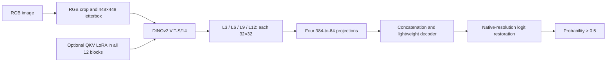

# Parameter-Efficient DINOv2 Adaptation for Colonoscopic Polyp Segmentation

A research study of intermediate transformer representations, lightweight decoders and parameter-efficient adaptation, with explicit normal-frame and cross-center failure analysis.

**Final selected configuration:** DINOv2 ViT-S/14 + L3/L6/L9/L12 fusion + all-12-block QKV LoRA (r=4, alpha=8, fixed LoRA LR=5e-5). **541,377 trainable parameters**, including 73,728 LoRA parameters; original DINOv2 tensors remain unchanged.

> **Final LoRA: 89.193349% positive-only Micro Dice; 84.846801% positive-image Macro Dice.** Internal development validation: 219 positive + 38 normal frames, fixed epoch 20, probability >0.5. TP=25,851,756; FP=1,782,932; FN=4,481,457. These are development results, not independent clinical validation.

## Main results: a common evaluation protocol

The following predictions were independently recomputed against the same native-resolution, hash-verified ground truth. Primary Dice is **2ΣTP / (2ΣTP + ΣFP + ΣFN)** over positive images only. Normal frames never enter Dice; their false positives are separate. “Macro” means the equally weighted mean of positive-image Dice.

| Model / experimental control | Micro Dice | Macro Dice | Trainable parameters | Normal any-FP | Normal >0.1% FP | Normal mean FG | Empty positives |
|---|---:|---:|---:|---:|---:|---:|---:|
| Frozen (LoRA control) | 86.7171% | 81.9431% | 467,649 | 14/38 | 13/38 | 0.2891% | 3 |
| Frozen (historical FT control) | 87.2686% | 82.7368% | 467,649 | 11/38 | 7/38 | 0.1606% | 3 |
| LastBlock FT | 88.3737% | 84.4470% | 2,242,881 | 13/38 | 11/38 | 0.6243% | 4 |
| LoRA LR1e-4 | 89.9913% | 84.8737% | 541,377 | 10/38 | 9/38 | 1.1078% | 7 |
| Final LoRA LR5e-5 | 89.1933% | 84.8468% | 541,377 | 6/38 | 3/38 | 0.5695% | 7 |

[Machine-readable table](results/final_summary.csv) · [Recalculation evidence](results/final_recalculation.json)

**Same evaluation set does not mean the same paired training experiment.** Frozen (historical FT control) is paired with LastBlock FT; Frozen (LoRA control) is the later LoRA A/B reference. The LR refinement reuses completed A/B controls, rather than retraining simultaneous controls. Cross-row scores share a metric and validation set but do not establish a replicated causal comparison. The representation study's 82.4341% frozen run is another historical reference.

LR=1e-4 has higher Micro Dice (89.9913%). LR=5e-5 is retained for the normal-FP trade-off, **not because it maximizes Micro Dice**. Relative to its matched Frozen control, final LoRA improves positive segmentation and reduces normal FP counts, but mean normal foreground increases (0.2891% → 0.5695%) and empty positives increase (3 → 7). The original full continuation gate was not passed. Switching the reporting emphasis to Micro Dice is retrospective; original macro-based selection is preserved.

## Why this project

Limited colonoscopy labels make adaptation cost and failure behavior as important as aggregate accuracy. This study asks which pretrained DINOv2 depths support segmentation, whether updating a small subset of parameters helps, and where that improvement stops under center shift. The contribution is a controlled adaptation and evaluation study; the encoder and standard decoder operations are credited to their original authors.

## Method and architecture

`timm`'s `vit_small_patch14_dinov2.lvd142m` supplies the pretrained encoder. Each of L3/L6/L9/L12 is normalized and projected from 384 to 64 channels, concatenated, and decoded by convolutional blocks. **All four features have the same 32×32 spatial resolution at 448×448 input: multi-depth features, not true multi-scale features.** RGB-only cropping, letterboxing, and native-resolution logit restoration are shared by the compared predictions.



## Dataset and splits

- **Internal development:** public PolypGen C1–C4. The manifest contains 1,066 training rows; the fixed `old_C1` sampler excludes 96 expansion candidates, leaving **970 eligible frames**. Validation contains **219 positive and 38 normal frames**. This historical internal split includes single and sequence frames; the LOCO single-frame restriction does not apply to this split.
- **LOCO:** provenance-audited **1,518 single frames** from C1–C6 (1,394 positive, 124 normal). Every fold trains on five centers and evaluates the sixth. All sequence frames are excluded. [Manifest and protocol](configs/loco/).
- **Random split:** three image-level 80/20 seeds (20261006/7/8), with 304 validation frames per seed (279 positive, 25 normal). This can be optimistic because correlated images can cross partitions.
- Reliable patient/video IDs are unavailable: **no patient-independent or video-independent claim** is made. C5/C6 were previously examined; LOCO is robustness cross-validation, not an untouched blind test. Kvasir has not been run as a formal benchmark for this DINOv2 study.

[Detailed data preparation](docs/data.md) · [Protocol](docs/methodology.md)

## Final LoRA configuration

| Setting | Value |
|---|---|
| Trainable encoder additions | All 12 fused attention QKV projections; r=4, alpha=8, scaling=2 |
| Original encoder tensors | Frozen; unchanged in saved training audit |
| LoRA dropout / trainable bias | 0 / none |
| Learning rates | Decoder 1e-3; LoRA 5e-5, constant; no scheduler |
| Optimizer / weight decay | AdamW / 1e-4 |
| Seed / endpoint | 20261002 / fixed epoch 20 |
| Input / batch / updates | 448×448 / 9 / 20×152=3,040 |
| Precision / TF32 | FP32 / disabled |
| Loss | Valid-region BCE + soft Dice |
| Evaluation | Native restored logits strictly >0, equivalent to probability >0.5 |

[Portable configuration](configs/lora_final.json). Original selection considered macro Dice and normal FP. Micro Dice now provides the primary descriptive summary and does not retroactively change the selected run.

## Representation ablation

| Representation | Positive-image Macro Dice |
|---|---:|
| L12 only | 78.1703% |
| L9 only (best tested single depth) | 80.1793% |
| L3/L6/L9/L12 fusion | 82.4341% |

Fusion improves by **4.2638 pp over L12**, and **2.2548 pp over L9** in this study. These are historical macro results, not the final LoRA Micro Dice protocol. Single-seed evidence does not establish universal superiority. [Detailed ablations](docs/experiments.md).

## Cross-center generalization: Frozen model

**LOCO, random-split and external experiments below used the frozen encoder model, not final LoRA. No LoRA LOCO or external evaluation is claimed.**

| Held-out center | Positive-image Macro Dice |
|---|---:|
| C1 | 80.07% |
| C2 | 82.78% |
| C3 | 83.53% |
| C4 | 59.88% |
| C5 | 67.86% |
| C6 | 80.64% |

Center-equal mean ± sample SD: **75.79 ± 9.66 pp**. This is a mean of six center-wise image-macro scores, not a pooled Micro Dice and not comparable to 89.19% final validation Micro Dice. Three image-level random splits give **80.59 ± 1.63 pp**, 4.80 pp higher descriptively; split design and training pools differ, so this is not an isolated causal estimate of domain shift.

## Failure analysis

C4 shows substantial background false positives and over-segmentation. A main-view preprocessing diagnostic changes C4 macro Dice from **59.88% to 63.77%**; input formatting is only a partial explanation, and this post-hoc diagnostic is not a replacement LOCO headline. C5 combines missed small targets and false positives: small/medium/large Dice **58.78% / 80.99% / 89.06%**. Final LoRA retains **7 empty positive predictions** and 16 severe failures (positive-image Dice <0.5). Improvements in pooled overlap do not eliminate catastrophic misses.

## External evaluation: locked historical Frozen checkpoint

| Dataset | Images | Positive-image Macro Dice | Evidence boundary |
|---|---:|---:|---|
| CVC-ColonDB | 380 | 70.63% | Foundation pretraining overlap unknown |
| ETIS | 196 | 70.71% | Previously used in development; not untouched/blind |
| CVC-300 | 60 | 89.25% | All 60 overlap this ColonDB release; not independent |

These positive-image datasets do not establish external normal-frame rejection. Do not pool them into an independent benchmark. [External evidence](docs/external_evaluation.md).

## Negative results

DetailSkip adds only **0.073 pp macro**, while worsening small-polyp and normal-FP behavior; rejected. The now-completed hierarchical decoder adds **0.557 pp macro**, but also worsens small-polyp and normal FP; rejected. LastBlock FT improves macro by **1.7103 pp** over its historical paired Frozen baseline, at a normal-FP cost. L7–L12-only LoRA (82.64% macro) and warmup+cosine (84.874% macro, worse normal FP) were not retained. All outcomes remain in [experiments](docs/experiments.md); original local evidence is preserved.

## Reproducibility

Install Python 3.12 and the appropriate PyTorch wheel, then:

```bash
python -m pip install -r requirements.txt
python scripts/smoke_test.py
python scripts/smoke_lora.py
# Recompute the published summary without data, weights or GPU:
python scripts/eval_micro_dice.py --records results/final/lora_final.jsonl
```

Obtain data and pretrained weights separately following [data preparation](docs/data.md). Commands below require explicitly supplied inputs; training requires CUDA and a time limit. No compute is provisioned automatically.

```bash
bash scripts/train_frozen.sh --data-root datasets/polypgen --weights weights/dinov2_vits14_pretrain.pth --output runs/frozen --max-seconds 3600
bash scripts/train_lora.sh --data-root datasets/polypgen --weights weights/dinov2_vits14_pretrain.pth --output runs/lora --max-seconds 3600
python scripts/eval.py --model lora --checkpoint weights/final-lora-epoch20.pt --require-final-lock --data-root datasets/polypgen --output runs/lora-eval
# Independent recomputation from archived native binary masks:
bash scripts/eval_micro_dice.sh --predictions predictions/predictions-20.zip --data-root datasets/polypgen
```

`--require-final-lock` checks the recorded checkpoint hash. For a newly trained model, omit that flag and label its score as a new run. `eval.py --model lastblock` supports compatible LastBlock checkpoints. Per-image count records allow arithmetic reproduction; full inference requires separately obtained data and checkpoints. Training wrappers preserve computational logic with documented portability edits, but this release did **not** rerun 20-epoch training or reproduce LoRA generalization. Exact scores can vary across environments. [Reproduction scope](docs/reproducibility.md).

## Repository structure

```text
README.md
requirements.txt
configs/                 # fixed protocols, split manifests, checkpoint identities
runtime/                 # encoder/decoder, LoRA, geometry, sampler, metrics, training
scripts/                 # portable train/evaluate/aggregate and CPU smoke commands
results/                 # compact counts, fair-metric tables and historical studies
assets/                  # aggregate architecture/CKA figures; no patient imagery
docs/                    # methodology, experiments, limitations and provenance
```

The existing `runtime/` layout is retained to preserve audited imports. Legacy experiments remain outside this curated Git repository; data, weights, prediction masks, credentials, environments and large recovery archives are excluded.

## Limitations and attribution

Observed validation guided repeated model choices; the final LoRA result is single-seed internal evidence. Parameter-efficient adaptation improves this development result, while center shift and catastrophic misses remain unresolved. Micro Dice weights large lesions more heavily; macro and failure metrics must accompany it. There is **no SOTA or clinical-readiness claim**. [Full limitations](docs/limitations.md).

[DINOv2](https://github.com/facebookresearch/dinov2), [timm](https://github.com/huggingface/pytorch-image-models), [PolypGen](https://www.nature.com/articles/s41597-023-01981-y), and [linear CKA](https://proceedings.mlr.press/v97/kornblith19a.html) are upstream work. This repository does not claim authorship of their architectures, data or methods. Earlier Medical-SAM3 team work is separate from this DINOv2 study. No project paper or DOI is claimed; cite the repository and exact commit. **License selection remains pending**; upstream and dataset terms continue to apply.
